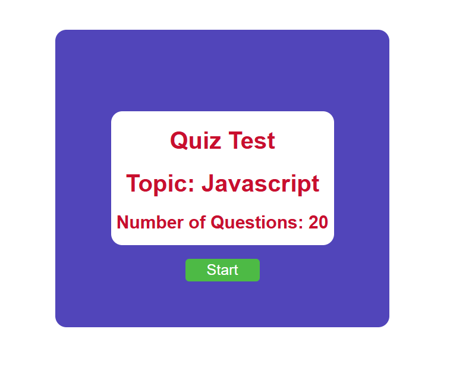

# Quiz App ⏱️

A simple and interactive **Quiz Application** with a timer functionality, built using **HTML, CSS, and JavaScript**.  
This project was developed as an assignment and is designed to test users’ knowledge with multiple-choice questions under a time limit.  




[🎥 Watch Demo Video](quiz-app-preview.mp4)


## 🚀 Features

- 📑 Multiple-choice questions  
- ⏱️ Timer functionality for each question  
- ✅ Immediate feedback on correct/wrong answers  
- 📊 Final score display at the end of the quiz  
- 🔁 "Play Again" option to restart the quiz  


## ⚙️ How It Works

1. **Start Quiz** → The quiz begins when the user clicks the start button.  
2. **Question Display** → One question is displayed at a time with four options.  
3. **Timer** → Each question has a countdown timer. If time runs out, the question is marked as wrong.  
4. **Answer Selection** → User clicks on an option to answer. Feedback is shown immediately.  
5. **Next Question** → Moves to the next question automatically or with a button.  
6. **Result** → At the end, the user sees their score along with correct and incorrect answers.  
7. **Play Again** → Users can restart the quiz anytime.  


## 🛠️ Technologies Used

- **HTML5** → Page structure  
- **CSS3** → Styling and layout  
- **JavaScript (ES6)** → Logic, timer, interactivity  


## 📂 Project Structure

Quiz-App/
│
├── index.html
├── style.css
├── script.js
├── Quiz/
│ ├── quiz_app_preview.PNG
│ └── quiz-app-preview.mp4
└── README.md


## 🚀 How to Use

Clone this repository:  
```bash
git clone https://github.com/your-username/Quiz-App.git


