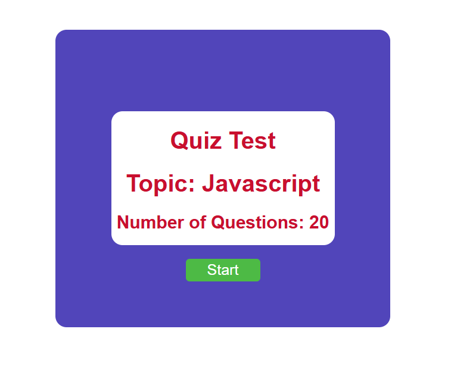

# Quiz App ⏱️

A simple and interactive **Quiz Application** with a timer functionality, built using **HTML, CSS, and JavaScript**.  
This to test users’ knowledge with multiple-choice questions under a time limit.





[🎥 Watch Demo Video](https://drive.google.com/file/d/1K1Wrzyb3xvdkDfzE0FzN3CCNPSIYYFBc/view?usp=drive_link)
## 🚀 Features

- 📑 Multiple-choice questions
- ⏱️ Timer functionality for each question
- ✅ Immediate feedback on correct/wrong answers
- 📊 Final score display at the end of the quiz
- 🔁 "Play Again" option to restart the quiz

  ## ⚙️ How It Works ## 

1. **Start Quiz** → The quiz begins when the user clicks the **Start** button.  
2. **Random Questions** → Out of 60 total questions, only **20 random questions** will be shown each time.  
3. **Question Display** → One question appears at a time with four answer options.  
4. **Timer Feature** → Each question has a countdown timer.  
   - If the timer ends → The question is marked as **Skipped**.  
5. **Answer Selection** →  
   - Correct selection → Added to **Correct** count  
   - Wrong selection → Added to **Wrong** count  
   Visual feedback is shown immediately.  
6. **Skipped Questions** → If a user doesn’t attempt a question, it counts as **Skipped**.  
7. **Live Score Display (Anchor Links)** →  
   **Correct**, **Wrong**, and **Skipped** are displayed as clickable **anchor `<a>` tags**.  
   - When clicked → An **alert box** shows only that specific count.  
   Example: Clicking “Wrong” shows only total wrong answers.  
8. **Next Question Navigation** → Moves to the next question automatically or using a **Next** link/button.  
9. **Final Result Screen** → Shows total correct, wrong, skipped counts, and score out of 20.  
10. **Play Again** → User can restart the quiz anytime with a new random set of 20 questions.

## 🛠️ Technologies Used

- **HTML5** → Page structure
- **CSS3** → Styling and layout
- **JavaScript (ES6)** → Logic, timer, interactivity

🧠 Responsive Quiz App

A simple and responsive Quiz Application built using HTML, CSS, and JavaScript.
It adjusts perfectly on all screen sizes — mobile, tablet, and desktop.

## 📂 Project Structure

Quiz-App/
│
├── index.html

├── style.css

├── script.js

├── Quiz/

│ ├── quiz_app_preview.PNG

│ └── quiz-app-preview.mp4

└── README.md

## 🚀 How to Use

Clone this repository:

```bash
git clone https://github.com/your-username/Quiz-App.git


**Project URL:** (https://github.com/ammulu3102/Quiz-App.git)


https://roadmap.sh/projects/quiz-app

```
